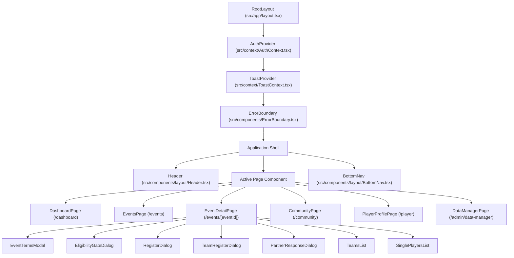

# System Architecture Documentation

## Architecture Overview (Frontend, Backend, Database)

The EveryWherePadel (EWP) platform utilizes a modern, reactive hybrid architecture spanning a Next.js 16 App Router full-stack runtime, Firebase serverless backend primitives, and native mobile shells.

```
┌─────────────────────────────────────────────────────────────────────────────┐
│                            CLIENT TIER (PWA & Native)                       │
│  - Next.js 16 App Router (React 19, Tailwind CSS 4, Radix UI Primitives)   │
│  - Capacitor Native Shells (iOS & Android distribution via 'out' export)   │
│  - Service Worker (FCM WebPush Push Notifications: firebase-messaging-sw)   │
│  - State Management: React Context (AuthContext, ToastContext) + URL State  │
└──────────────────────────────────────┬──────────────────────────────────────┘
                                       │
            ┌──────────────────────────┼──────────────────────────┐
            │ HTTPS / JSON API         │ Firestore Realtime SDK   │ Firebase Storage SDK
            │ (Mutations & Auth)       │ (Live Subscriptions)     │ (Direct CDN Uploads)
            ▼                          ▼                          ▼
┌──────────────────────────────┐ ┌────────────────────────────────────────────┐
│      NEXT.JS SERVER TIER     │ │              FIREBASE TIER                 │
│  - Edge/Node.js Middleware   │ │  - Cloud Firestore (10 Collections)        │
│    (CSRF, CSP, Security)     │ │  - Cloud Storage (Media, Pictures, Logos)  │
│  - App Router Route Handlers │ │  - Firebase Auth Identity Toolkit          │
│    (/api/auth/*, /api/users) │ │  - Firebase Cloud Messaging (FCM WebPush)  │
│  - Firebase Admin SDK        │ │  - Cloud Functions v2 (Node.js 22 runtime) │
│  - In-Memory Auth Caches     │ │    * onUserUpdate (Trigger on users/{uid}) │
└──────────────┬───────────────┘ │    * sendPushNotification (on notifications)│
               │                 │    * scheduledEventCleanup (Weekly cron)   │
               └────────────────►│    * recalculateEventCounts (onCall)       │
                  Admin Privileges└────────────────────────────────────────────┘
```

### 1. Frontend Tier
- **Framework:** Next.js 16 (App Router) with React 19.2.0.
- **Styling & Tokens:** Tailwind CSS 4 with `@tailwindcss/postcss`. HSL-defined design tokens in `globals.css` (`--background`, `--foreground`, `--primary: 24.6 95% 53.1%` [Padel Orange], `--card`, `--radius: 0.75rem`).
- **PWA & Native Mobile Shell:** Configured via `manifest.json`, meta tags in `src/app/layout.tsx`, and Capacitor 8 (`@capacitor/core`, `@capacitor/ios`, `@capacitor/android`, appId `com.ewpuae.app`).
- **Icons & UI Primitives:** Lucide React icons, Radix UI unstyled headless primitives (`@radix-ui/react-dialog`, `@radix-ui/react-select`, `@radix-ui/react-switch`, `@radix-ui/react-tabs`, `@radix-ui/react-avatar`).
- *Source: `package.json`, `capacitor.config.ts`, `src/app/globals.css`, `src/app/layout.tsx`*

### 2. Backend & Middleware Tier
- **Middleware:** `src/middleware.ts` running at edge/server entry. Enforces strict CSRF origin validation on mutating API requests (`POST`, `PUT`, `DELETE`, `PATCH` to `/api/*`) by ensuring `Origin` matches `Host`. Sets comprehensive HTTP security response headers.
- **API Route Handlers:** Located in `src/app/api/`. Uses higher-order security wrappers (`withApiAuth`, `withRole`, `withPermission`, `withOwnershipOrAdmin`).
- **Admin SDK:** Initialized lazily via `src/lib/firebase-admin.ts` using service account credentials (`FIREBASE_ADMIN_SERVICE_ACCOUNT_PATH`).
- *Source: `src/middleware.ts`, `src/lib/firebase-admin.ts`, `src/lib/auth/require-auth.ts`*

### 3. Database & Serverless Tier
- **Database:** Google Cloud Firestore (multi-region `nam5` in `(default)` database).
- **Security Rules:** `firestore.rules` (declarative access controls) and `storage.rules` (MIME and size gates).
- **Background Execution:** Cloud Functions v2 in `functions/src/` running on Node.js 22.
- *Source: `firebase.json`, `firestore.rules`, `storage.rules`, `functions/package.json`*

---

## Component Hierarchy & Data Flow

### 1. Client Component Hierarchy



### 2. End-to-End Data Flow

#### Flow A: Real-Time Event Roster Subscription
1. Player visits `/events/[eventId]`.
2. Client mounts `onSnapshot` listener to `doc(db, "events", eventId)`.
3. Client mounts separate `onSnapshot` listener to `collection(db, "registrations")` filtering `where("eventId", "==", eventId)`.
4. Client mounts third `onSnapshot` listener to `collection(db, "teams")` filtering `where("eventId", "==", eventId)`.
5. Unique player UIDs are gathered into a batch query against `users` collection to hydrate names and avatar images.
6. When another player registers, cancels, or accepts an invite, Firestore pushes snapshot deltas to all connected clients in real time without polling.
- *Source: `src/app/events/[eventId]/page.tsx#L112-L220`*

#### Flow B: Asynchronous Cloud Messaging (Push Notifications)
1. System or user action creates a notification document in `notifications/{notificationId}`.
2. Cloud Firestore trigger `sendPushNotification` (`onDocumentCreated("notifications/{notificationId}")`) fires in Cloud Functions v2.
3. Function reads target user's profile document (`users/{userId}`) and extracts array of device tokens (`fcmTokens`).
4. Function dispatches multicast messages via `admin.messaging().sendEach(messages)` with payload links to `/dashboard` or `/events/[eventId]`.
5. Stale or invalid tokens (`messaging/registration-token-not-registered`) are stripped and updated in Firestore.
6. Browser service worker (`public/firebase-messaging-sw.js`) intercepts push events and renders native notifications.
- *Source: `functions/src/sendPushNotification.ts#L11-L125`, `public/firebase-messaging-sw.js`*

---

## Security Implementation (AuthN, AuthZ, Session Management, Secret Handling)

### 1. Authentication (AuthN)
- **Primary Credentials:** Managed through Firebase Auth with email/password, Google OAuth, and Apple Sign-In.
- **Dual JWT Token Architecture:**
  - **Access Token:** Short-lived (15 minutes / 900 seconds) custom JWT signed using HMAC-SHA256 (`HS256`) via `ACCESS_TOKEN_SECRET`. Holds claims `sub`, `email`, `role`, `isAdmin`, `isEmailVerified`, `iss: "EveryWherePadel"`, `aud: "EveryWherePadelApp"`, `jti`, `iat`, `exp`. Stored strictly **in memory** within JavaScript React state (`AuthContext`) to mitigate XSS exfiltration.
  - **Refresh Token:** Long-lived (7 days / 604,800 seconds) signed JWT issued inside a hardened HTTP-only cookie (`__Host-refreshtoken` in production with `Secure`, `HttpOnly`, `SameSite=Strict`, `Path=/`).
  - *Source: `src/lib/auth/tokens.ts#L42-L130`, `src/context/AuthContext.tsx#L31-L32`*
- **Multi-Factor Authentication (MFA):**
  - RFC 6238 Time-based One-Time Password (TOTP). Generates 16-character Base32 secrets.
  - Validates 6-digit codes with a $\pm 1$ time-step window (30-second grace period for clock skew).
  - Issues 8 cryptographically random single-use backup codes (hashed using SHA-256 in Firestore).
  - Employs 5-minute ephemeral pending tokens (`MFA_JWT_SECRET`) to bridge primary sign-in to second-factor completion.
  - *Source: `src/lib/auth/mfa.ts`, `src/app/api/auth/mfa/enroll/route.ts`, `src/app/api/auth/mfa/verify/route.ts`*
- **Social OAuth Identity Mapping & PKCE:**
  - Implements state verification (`validateState`) to block OAuth CSRF.
  - OIDC ID token claim verification checking `iss`, `aud`, `exp`, and `sub`.
  - Durable identity binding via `federatedId` (`apple:<sub>` or `google:<sub>`).
  - *Source: `src/lib/auth/pkce-oidc.ts`, `src/lib/auth/apple-auth.ts`*

### 2. Authorization (AuthZ) & RBAC / ABAC
- **Dual-Layer Defense:** Security is enforced both at the application server tier (Next.js API route guards) and at the storage engine tier (Firestore Security Rules).
- **Server Guard Functions (`src/lib/auth/require-auth.ts`):**
  - `withApiAuth`: Rejects unauthenticated requests with HTTP 401.
  - `withRole(role)`: Validates role hierarchy (`admin` $\succ$ `auditor` $\succ$ `player`/`user`). Rejects with HTTP 403.
  - `withPermission(permission)`: Checks exact or domain-wildcard string permissions (e.g., `events:*`).
  - `withOwnershipOrAdmin(targetOwnerUid)`: Enforces Attribute-Based Access Control (ABAC), ensuring users can modify only their own resources unless they possess the `isAdmin` flag.
  - *Source: `src/lib/auth/require-auth.ts#L45-L120`, `src/lib/auth/rbac-abac.ts#L31-L69`*
- **Database Engine Rules (`firestore.rules`):**
  - Evaluates Firebase Auth custom claim `request.auth.token.admin == true`, with safe fallback to `get(.../users/$(request.auth.uid)).data.get('role', '') == 'admin'`.
  - `users/{uid}`: Non-admin users cannot alter `role`, `isAdmin`, or `isShadow` fields during document creation or update.
  - Sensitive collections (`refresh_token_families`, `revoked_jtis`, `brute_force_attempts`) are locked to `allow read, write: if false;`, accessible strictly via the server-side Firebase Admin SDK.
  - `events/{eventId}`: Updates by non-admin authenticated users are restricted to `request.resource.data.diff(resource.data).affectedKeys().hasOnly(['registrationsCount', 'waitlistCount'])`.
  - *Source: `firestore.rules#L10-L74`*

### 3. Session Management & Revocation
- **Session Family Lineage & Replay Protection:**
  - Refresh tokens belong to a session family (`tokenFamilyId`).
  - Upon each refresh request, the current JTI is validated against `currentJti`. A new JTI is generated, and the consumed JTI is moved to `usedJtis`.
  - **Replay Attack Detection:** If a previously used JTI is submitted (indicating token theft), the system flags the breach, immediately marks `isRevoked: true` on the session family, and rejects the request.
  - **Absolute Session Max Age:** Enforces a hard 30-day session cap (`ABSOLUTE_SESSION_MAX_AGE_MS = 30 * 24 * 60 * 60 * 1000`) calculated from `initialLoginAt`.
  - *Source: `src/lib/auth/session-family.ts#L78-L160`*
- **Instant Access Token Invalidation (JTI Revocation):**
  - Revoking an access token (e.g., on logout or security event) writes its JTI and remaining lifetime to the `revoked_jtis` Firestore collection.
  - Every access token validation queries `isJtiRevoked(jti)` to guarantee instant cutoff before natural token expiration.
  - *Source: `src/lib/auth/jti-revocation.ts#L24-L78`*
- **Global Sign-Out:**
  - `POST /api/auth/logout-all` queries all active session families for the user in `refresh_token_families` and marks them `isRevoked: true` in an atomic batch.
  - *Source: `src/lib/auth/jti-revocation.ts#L83-L126`, `src/app/api/auth/logout-all/route.ts`*

### 4. Secret Handling & Cryptography
- Secrets are stored in environment variables (`ACCESS_TOKEN_SECRET`, `REFRESH_TOKEN_SECRET`, `MFA_JWT_SECRET`, `ADMIN_API_KEY`, `FIREBASE_ADMIN_SERVICE_ACCOUNT_PATH`).
- Missing token secrets cause a fatal fail-fast process termination at startup.
- Cryptographic primitives utilize Node.js built-in `crypto` module (`crypto.createHmac("sha256")`, `crypto.randomBytes(16)`).
- Passwords are never stored in plaintext; Firebase Authentication handles underlying scrypt password hashing.
- *Source: `src/lib/auth/tokens.ts#L29-L40`, `src/lib/auth/password-security.ts`, `.env.example`*

---

## Non-Functional Capabilities (Caching, Rate Limiting, Queues, Pagination)

### 1. Rate Limiting & Brute-Force Protection
- **Sliding-Window Memory Limiter:** `src/lib/auth/rate-limit.ts` maintains in-memory tracking of IP and email keys (`signup:ip:*`, `signup:email:*`) allowing 5 attempts per 60-second window.
- **Persistent Brute-Force Controller:** `src/lib/auth/brute-force.ts` implements a write-through cache combining local memory with the `brute_force_attempts` Firestore collection. Tracks failed sign-in attempts per IP and target email over a 15-minute sliding window. Enforces CAPTCHA at 3 failures and lockout at 5 failures.
- *Source: `src/lib/auth/rate-limit.ts`, `src/lib/auth/brute-force.ts`*

### 2. Caching & Memory Write-Through Layers
- **Session Family Store:** `inMemoryFamilyStore` provides immediate local memory lookup with authoritative write-through to Cloud Firestore `refresh_token_families`.
- **JTI Revocation Cache:** `inMemoryRevokedJtis` caches active revoked token identifiers with automatic memory purging of expired records.
- **Profile Caching:** Client components utilize `useRef(new Set())` and React state memoization to avoid duplicate user profile reads during roster hydration.
- *Source: `src/lib/auth/session-family.ts#L17`, `src/lib/auth/jti-revocation.ts#L9-L18`, `src/app/events/[eventId]/page.tsx#L68-L70`*

### 3. Background Processing & Queues
- **Scheduled Event Status Cleanup:** Cloud Function `scheduledEventCleanup` triggers weekly (`onSchedule("every sunday 00:00")`), executing batch updates of 500 documents to transition expired events from `Upcoming` to `Past`.
- **Event-Driven Push Notifications:** Cloud Function `sendPushNotification` operates as an asynchronous queue triggered on `notifications/{id}` document creation.
- *Source: `functions/src/updateEventStatus.ts#L64-L71`, `functions/src/sendPushNotification.ts#L11-L20`*

### 4. Pagination & Query Optimization
- **Data Manager Limit:** Queries capped at 100 documents per fetch (`limit(100)`) with client-side text filtering.
- **Admin User Listing:** Uses cursor pagination with `nextPageToken` and configurable batch limits (`limit = 100`).
- **Composite Indexes:** Defined in `firestore.indexes.json` for compound queries (e.g., `events` by `status ASC` + `dateTime ASC`; `registrations` by `eventId ASC` + `status ASC` + `registeredAt ASC`).
- *Source: `src/app/admin/data-manager/page.tsx#L145-L151`, `src/app/api/list-users/route.ts#L6-L22`, `firestore.indexes.json`*

---

## Observability (Logging, Telemetry, Error Tracking)

### 1. Structured Security Audit Logging
- **Audit Collection:** Security-sensitive events are recorded to `auth_audit_logs` in Firestore via `logAuthSecurityEvent`.
- **Event Types:** `LOGIN_SUCCESS`, `LOGIN_FAILED`, `LOCKOUT_TRIGGERED`, `PASSWORD_RESET_REQUESTED`, `CAPTCHA_REQUIRED`, `ACCOUNT_DELETED`.
- **Redaction Rule:** Explicit policy forbids logging raw passwords, secret tokens, or sensitive payload credentials. Logs capture client IP, normalized email/UID, ISO 8601 timestamp, User-Agent, and non-sensitive event metadata.
- **In-Memory Ring Buffer:** Retains the 500 most recent audit logs in memory (`inMemoryAuditLogs`) for rapid testing and diagnostics.
- *Source: `src/lib/auth/audit-logger.ts#L1-L60`*

### 2. Cloud Functions Telemetry
- Uses `firebase-functions/logger` (`logger.info`, `logger.warn`, `logger.error`, `logger.debug`) which exports structured logs directly to Google Cloud Logging (Stackdriver).
- *Source: `functions/src/index.ts#L12`, `functions/src/sendPushNotification.ts#L2`*

### 3. Client Error Handling & Boundaries
- **Component Boundary:** `src/components/ErrorBoundary.tsx` wraps top-level children in `src/app/layout.tsx`. Catches unhandled React lifecycle rendering exceptions, logs errors to console, and presents a recovery UI ("Something went wrong") with a "Try Again" reload action.
- **Global Toast Notification Service:** `src/context/ToastContext.tsx` handles transient user-facing feedback with queue management and auto-dismissal.
- *Source: `src/components/ErrorBoundary.tsx`, `src/context/ToastContext.tsx`, `src/app/layout.tsx#L75-L77`*

---

## Infrastructure & Deployment Model (CI/CD, Containers, Hosting Assumptions)

### 1. Hosting & Runtimes
- **Web App Hosting:** Configured for Firebase App Hosting / Cloud Hosting frameworks backend (`region: "us-central1"`). Next.js server executed via App Router server functions.
- **Allowed Development Origins:** Configured in `next.config.mjs` for Replit domains (`*.sisko.replit.dev`, `*.replit.dev`, `*.repl.co`) and local development (`localhost:5000`, `127.0.0.1:5000`).
- *Source: `firebase.json#L28-L38`, `next.config.mjs#L78-L84`*

### 2. Mobile Native Packaging
- Built with Capacitor 8 CLI. The Next.js web application is exported to the static directory `out` (`webDir: 'out'`).
- Android configuration located in `android/` directory.
- iOS configuration located in `ios/` directory.
- *Source: `capacitor.config.ts`, `package.json#L12-L15`*

### 3. Emulators & Local Development
- Local Firebase Emulator Suite configured in `firebase.json`:
  - Auth: Port `9099`
  - Cloud Functions: Port `5001`
  - Cloud Firestore: Port `8080`
  - Realtime Database: Port `9000`
  - Hosting: Port `5000`
  - Storage: Port `9199`
  - Cloud Tasks: Port `9499`
  - App Hosting emulator: Port `5002`
  - Emulator UI: Enabled (`singleProjectMode: true`)
- *Source: `firebase.json#L39-L70`*

---

## Technical Debt & Architectural Risks

1. **Serverless In-Memory State Divergence:**
   - In-memory data structures (`attemptStore` in `brute-force.ts`, `inMemoryFamilyStore` in `session-family.ts`, `inMemoryRevokedJtis` in `jti-revocation.ts`, and `globalRateLimitStore` in `rate-limit.ts`) operate across multi-instance serverless deployments (Cloud Run / Vercel / App Hosting). While Firestore write-through is implemented for session families, revoked JTIs, and brute-force records, rate limiting relies strictly on memory. Rapid requests routed across different server instances could bypass the in-memory rate limiter.
   - *Source: `src/lib/auth/rate-limit.ts#L11-L49`*
2. **Client-Driven Registration Writing:**
   - Some participation actions (such as direct creation of `registrations` in `useTeamInvite.ts`) execute from client components via Firestore client SDK rather than behind a transactional server route handler. While guarded by Firestore Security Rules, this exposes complex business logic to client-side network interruptions midway through composite writes.
   - *Source: `src/hooks/useTeamInvite.ts#L4-L12`, `firestore.rules#L76-L91`*
3. **Placeholder Social OAuth Secrets:**
   - Apple configuration (`APPLE_CONFIG` in `src/lib/auth/apple-auth.ts`) defaults to placeholder strings (`YOUR_APPLE_TEAM_ID_PLACEHOLDER`, `YOUR_APPLE_KEY_ID_PLACEHOLDER`, `YOUR_APPLE_PRIVATE_KEY_PLACEHOLDER`) if environment variables are omitted, silently skipping live Apple token revocation during account deletion.
   - *Source: `src/lib/auth/apple-auth.ts#L15-L20`, `src/lib/auth/account-deletion.ts#L23-L26`*
4. **Empty Subdirectory in Event Management:**
   - The directory `src/app/events/[eventId]/manage` is present in the filesystem but empty, which could lead to dead routes if referenced by administrative links.
   - *Source: `src/app/events/[eventId]/manage/`*
5. **No Payment Gateway / Financial Audit Trail:**
   - Despite monetary fee fields (`pricePerPlayer`) across the schema, no payment gateway webhooks or transaction tables exist, meaning event fee collection must occur out-of-band.
   - *Source: `collections.json#L43`, `src/types/index.ts#L16`*
