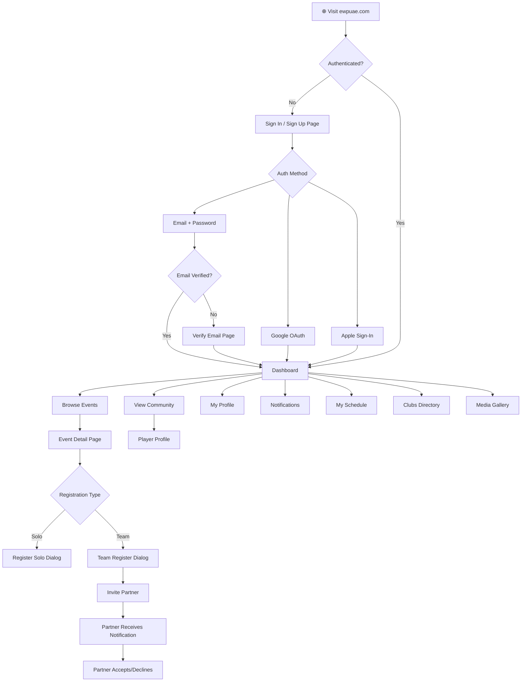
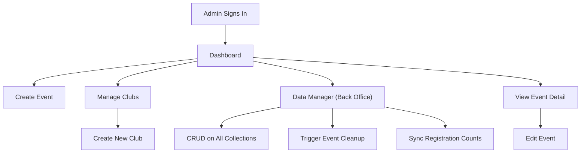
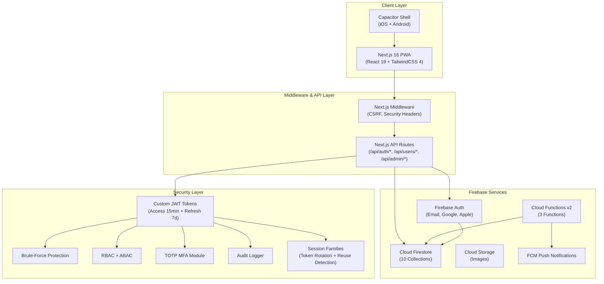
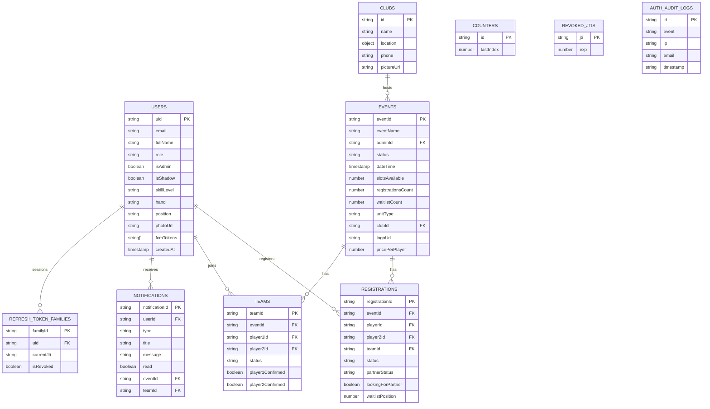
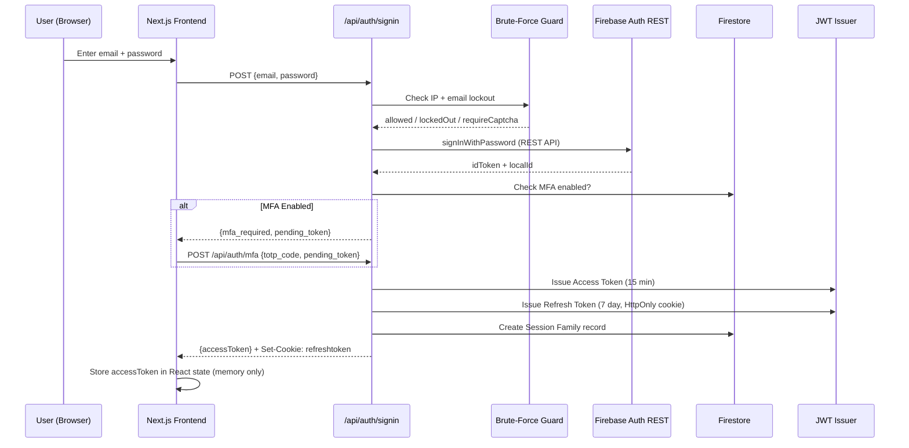
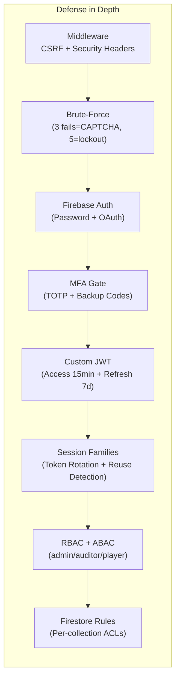

# EveryWherePadel — Full Application Architecture Report

> **App Name**: EveryWherePadel (EWP)
> **Domain**: `ewpuae.com`
> **Stack**: Next.js 16 + Firebase + Capacitor (iOS/Android)
> **Date**: July 27, 2026

---

## 1. Purpose & What the App Does

**EveryWherePadel** is a **Padel sports event management platform** built for the UAE market. It allows:

- **Players** to discover padel events, register solo or as teams, find partners, and manage their event schedule.
- **Admins** to create and manage events, venues (clubs), users, and view data through a back-office data manager.

The app is deployed as a **PWA** (Progressive Web App) with **Capacitor** wrappers for native Android/iOS distribution.

---

## 2. User Journey

### Player Journey

### Admin Journey

---

## 3. Architecture Overview

### Tech Stack Summary

| Layer          | Technology                                       |
| -------------- | ------------------------------------------------ |
| **Frontend**   | Next.js 16, React 19, TailwindCSS 4, Radix UI    |
| **Validation** | Zod + React Hook Form                            |
| **Icons**      | Lucide React                                     |
| **Auth**       | Firebase Auth + Custom JWT (HS256)               |
| **Database**   | Cloud Firestore                                  |
| **Storage**    | Firebase Storage                                 |
| **Push**       | Firebase Cloud Messaging (FCM)                   |
| **Backend**    | Next.js API Routes + Firebase Cloud Functions v2 |
| **Mobile**     | Capacitor (iOS + Android)                        |
| **Date/Time**  | date-fns, date-fns-tz                            |

---

## 4. All Pages & Routes

### Frontend Pages

| Route                    | File                                                                                                                       | Access | Description                                                  |
| ------------------------ | -------------------------------------------------------------------------------------------------------------------------- | ------ | ------------------------------------------------------------ |
| `/`                      | [page.tsx](file:///c:/Users/dell/.gemini/antigravity/scratch/firebase-auth-app/src/app/page.tsx)                           | Public | Splash/loader — redirects to `/dashboard` or `/auth/signin`  |
| `/auth/signin`           | [page.tsx](file:///c:/Users/dell/.gemini/antigravity/scratch/firebase-auth-app/src/app/auth/signin/page.tsx)               | Public | Sign In + Sign Up + Forgot Password + OAuth                  |
| `/auth/verify-email`     | [page.tsx](file:///c:/Users/dell/.gemini/antigravity/scratch/firebase-auth-app/src/app/auth/verify-email/page.tsx)         | Auth   | Email verification holding page                              |
| `/dashboard`             | [page.tsx](file:///c:/Users/dell/.gemini/antigravity/scratch/firebase-auth-app/src/app/dashboard/page.tsx)                 | Auth   | Main hub — nav cards, PWA install prompts, push permission   |
| `/events`                | [page.tsx](file:///c:/Users/dell/.gemini/antigravity/scratch/firebase-auth-app/src/app/events/page.tsx)                    | Public | Browse/filter all events                                     |
| `/events/create`         | [page.tsx](file:///c:/Users/dell/.gemini/antigravity/scratch/firebase-auth-app/src/app/events/create/page.tsx)             | Admin  | Create a new padel event                                     |
| `/events/[eventId]`      | [page.tsx](file:///c:/Users/dell/.gemini/antigravity/scratch/firebase-auth-app/src/app/events/%5BeventId%5D/page.tsx)      | Public | Event detail — registrations, teams, waitlist                |
| `/events/[eventId]/edit` | [page.tsx](file:///c:/Users/dell/.gemini/antigravity/scratch/firebase-auth-app/src/app/events/%5BeventId%5D/edit/page.tsx) | Admin  | Edit event details, cancel event                             |
| `/community`             | [page.tsx](file:///c:/Users/dell/.gemini/antigravity/scratch/firebase-auth-app/src/app/community/page.tsx)                 | Auth   | Browse all registered players                                |
| `/player`                | [page.tsx](file:///c:/Users/dell/.gemini/antigravity/scratch/firebase-auth-app/src/app/player/page.tsx)                    | Auth   | Own profile view + edit                                      |
| `/player/my-schedule`    | [page.tsx](file:///c:/Users/dell/.gemini/antigravity/scratch/firebase-auth-app/src/app/player/my-schedule/page.tsx)        | Auth   | Player's registered events schedule                          |
| `/clubs`                 | [page.tsx](file:///c:/Users/dell/.gemini/antigravity/scratch/firebase-auth-app/src/app/clubs/page.tsx)                     | Public | Browse all padel clubs                                       |
| `/clubs/create`          | [page.tsx](file:///c:/Users/dell/.gemini/antigravity/scratch/firebase-auth-app/src/app/clubs/create/page.tsx)              | Admin  | Create a new club/venue                                      |
| `/notifications`         | [page.tsx](file:///c:/Users/dell/.gemini/antigravity/scratch/firebase-auth-app/src/app/notifications/page.tsx)             | Auth   | View/manage notifications                                    |
| `/media`                 | [page.tsx](file:///c:/Users/dell/.gemini/antigravity/scratch/firebase-auth-app/src/app/media/page.tsx)                     | Public | Media gallery browser                                        |
| `/admin/data-manager`    | [page.tsx](file:///c:/Users/dell/.gemini/antigravity/scratch/firebase-auth-app/src/app/admin/data-manager/page.tsx)        | Admin  | Back-office: CRUD all collections, event cleanup, count sync |

### API Routes

| Endpoint                      | Method      | Purpose                                                                   |
| ----------------------------- | ----------- | ------------------------------------------------------------------------- |
| `/api/auth/signin`            | POST        | Server-side sign-in with brute-force protection, MFA gating, JWT issuance |
| `/api/auth/signup`            | POST        | Server-side user registration                                             |
| `/api/auth/refresh`           | POST        | Rotate refresh token, issue new access token                              |
| `/api/auth/logout`            | POST        | Revoke session, clear refresh cookie                                      |
| `/api/auth/logout-all`        | POST        | Global sign-out (revoke all sessions)                                     |
| `/api/auth/mfa`               | POST        | Verify TOTP/backup code for MFA                                           |
| `/api/auth/oauth`             | POST        | OAuth token exchange (Google/Apple)                                       |
| `/api/auth/validate-password` | POST        | Password strength validation                                              |
| `/api/auth/verify-email`      | POST        | Email verification flow                                                   |
| `/api/auth/delete-account`    | POST/DELETE | Full account deletion (Apple token revocation)                            |
| `/api/users/update-profile`   | POST/PUT    | Profile update                                                            |
| `/api/users/change-password`  | POST        | Password change                                                           |
| `/api/admin/users`            | GET/POST    | Admin user management                                                     |
| `/api/list-users`             | GET         | List users (for community/admin)                                          |

---

## 5. Database Collections (Firestore)

### Collection Details

| Collection | Doc Count Pattern   | Client R/W                   | Server Only        |
| -------------------------------------- | ------------------- | ---------------------------- | ------------------ |
| `users`                                | 1 per user          | ✅ Read/Write (own)           | —                  |
| `events`                               | 1 per event         | ✅ Read (all), Write (admin)  | —                  |
| `registrations`                        | 1 per player×event  | ✅ Read/Write (own+admin)     | —                  |
| `teams`                                | 1 per team×event    | ✅ Read/Write (members+admin) | —                  |
| `clubs`                                | 1 per venue         | ✅ Read (all), Write (admin)  | —                  |
| `notifications`                        | N per user          | ✅ Read/Write (own)           | —                  |
| `counters`                             | ~1 (events counter) | ✅ Read/Write (auth)          | —                  |
| `media_library`                        | N items             | ✅ Read (all), Write (admin)  | —                  |
| `refresh_token_families`               | 1 per session       | ❌                            | ✅ Admin SDK only   |
| `revoked_jtis`                         | 1 per revoked token | ❌                            | ✅ Admin SDK only   |
| `auth_audit_logs`                      | N per auth event    | ❌ (Read: admin only)         | ✅ Write: Admin SDK |

---

## 6. Major Workflows (Step by Step)

### 6.1 — Authentication Flow

### 6.2 — Event Registration (Solo Player)

1. Player opens `/events/[eventId]`
2. Clicks "Register" → `RegisterDialog` opens
3. Checks if slots are available (`slotsAvailable > registrationsCount`)
4. Creates a `registrations` document with status `CONFIRMED` (or `WAITLIST` if full)
5. Increments `registrationsCount` on the event document (via transaction)
6. Creates a `notifications` document for the player (triggers FCM push via Cloud Function)

### 6.3 — Team Registration & Partner Invite

1. Player opens event → clicks "Register as Team" → `TeamRegisterDialog` opens
2. Selects a partner from the community list
3. `useTeamInvite` hook runs a Firestore transaction:
   - Creates a `teams` document (status: `PENDING`)
   - Creates `registrations` for player1 (status: `CONFIRMED`, `partnerStatus: PENDING`)
   - Creates `registrations` for player2 (status: `PENDING`, `partnerStatus: PENDING`)
   - Creates a `notifications` document (type: `partner_invite`)
4. Partner receives push notification
5. Partner opens the event page → sees `PartnerResponseDialog`
6. On Accept → `useTeamAccept` hook:
   - Updates team status to `CONFIRMED`
   - Updates both registrations to `CONFIRMED`
   - Increments event `registrationsCount`
   - Creates acceptance notification
7. On Decline → `useTeamDissolve` hook:
   - Deletes team document
   - Cleans up registrations
   - Sends decline notification

### 6.4 — Waitlist Promotion

1. When a confirmed player/team withdraws (`useEventWithdraw`)
2. Hook queries for oldest `WAITLIST` registration
3. Promotes it to `CONFIRMED`
4. Sends `WAITLIST_PROMOTED` notification to the promoted player
5. Decrements `waitlistCount`, increments `registrationsCount`

### 6.5 — Push Notifications (FCM)

1. Dashboard prompts user to grant notification permission
2. `usePushNotifications` hook gets FCM token and stores it in `users.fcmTokens[]`
3. When any hook creates a `notifications` document in Firestore
4. Cloud Function `sendPushNotification` triggers on document creation
5. Reads user's `fcmTokens`, sends FCM messages
6. Cleans up invalid tokens automatically

### 6.6 — Admin Event Lifecycle

1. Admin creates event via `/events/create` → auto-generates `eventId` from `counters`
2. Weekly scheduled Cloud Function `scheduledEventCleanup` marks past events as `"Past"`
3. Admin can manually trigger cleanup from Data Manager
4. Admin can recalculate registration counts via `recalculateEventCounts` callable function

---

## 7. Risk Assessment, Gaps & Improvement Opportunities

### 🔴 Critical Risks

| #   | Risk                                                  | Details                                                                                                                                                                                                                                              | Impact                                                     |
| --- | ----------------------------------------------------- | ---------------------------------------------------------------------------------------------------------------------------------------------------------------------------------------------------------------------------------------------------- | ---------------------------------------------------------- |
| R1  | **Hardcoded JWT secrets**                             | [tokens.ts L29-30](file:///c:/Users/dell/.gemini/antigravity/scratch/firebase-auth-app/src/lib/auth/tokens.ts#L29-L30) — Fallback secrets are hardcoded in source code. If env vars are missing, anyone who reads the source can forge tokens.       | **Critical** — Full auth bypass                            |
| R2  | **MFA secret hardcoded**                              | [mfa.ts L16](file:///c:/Users/dell/.gemini/antigravity/scratch/firebase-auth-app/src/lib/auth/mfa.ts#L16) — `MFA_JWT_SECRET` has a hardcoded fallback.                                                                                               | **High** — MFA bypass                                      |
| R3  | **In-memory brute-force store**                       | [brute-force.ts L22](file:///c:/Users/dell/.gemini/antigravity/scratch/firebase-auth-app/src/lib/auth/brute-force.ts#L22) — `attemptStore` is a `Map` in process memory. Resets on server restart and doesn't work across multiple instances.        | **High** — Brute-force protection unreliable in production |
| R4  | **In-memory session/JTI caches**                      | [session-family.ts L17](file:///c:/Users/dell/.gemini/antigravity/scratch/firebase-auth-app/src/lib/auth/session-family.ts#L17) — `inMemoryFamilyStore` doesn't sync across instances. Token reuse detection can fail in multi-instance deployments. | **High** — Security bypass under load                      |
| R5  | **Email verification is OFF**                         | [signin/page.tsx L38](file:///c:/Users/dell/.gemini/antigravity/scratch/firebase-auth-app/src/app/auth/signin/page.tsx#L38) — `EMAIL_VERIFICATION_ON = "off"`. Any email can register without verification.                                          | **Medium** — Fake accounts, abuse                          |
| R6  | **Account deletion returns `success: true` on error** | [account-deletion.ts L113](file:///c:/Users/dell/.gemini/antigravity/scratch/firebase-auth-app/src/lib/auth/account-deletion.ts#L113) — Catch block returns `success: true`. User thinks account is deleted but data may persist.                    | **Medium** — Data privacy / GDPR violation                 |

### 🟡 Significant Gaps

| #   | Gap                                              | Details                                                                                                                                                                                                                                                                                                                                                                                                                                  | Recommendation                                  |
| --- | ------------------------------------------------ | ---------------------------------------------------------------------------------------------------------------------------------------------------------------------------------------------------------------------------------------------------------------------------------------------------------------------------------------------------------------------------------------------------------------------------------------- | ----------------------------------------------- |
| G1  | **No automated tests**                           | Zero test files found in the repository. No unit, integration, or E2E tests.                                                                                                                                                                                                                                                                                                                                                             | Add Jest + React Testing Library + Playwright   |
| G2  | **No CI/CD pipeline**                            | No GitHub Actions, no `.github/workflows`. Deployments appear manual.                                                                                                                                                                                                                                                                                                                                                                    | Set up CI with lint, test, build, deploy stages |
| G3  | **`manualEventCleanup` has no admin auth check** | [updateEventStatus.ts L76-80](file:///c:/Users/dell/.gemini/antigravity/scratch/firebase-auth-app/functions/src/updateEventStatus.ts#L76-L80) — The auth check is commented out. Any authenticated user can trigger event cleanup.                                                                                                                                                                                                       | Uncomment and enforce admin check               |
| G4  | **Storage rules allow unrestricted reads**       | [storage.rules L27-29](file:///c:/Users/dell/.gemini/antigravity/scratch/firebase-auth-app/storage.rules#L27-L29) — `allow read: if true` on root path. All stored files (including profile pictures) are publicly accessible.                                                                                                                                                                                                           | Restrict based on auth status at minimum        |
| G5  | **Events readable by anyone**                    | [firestore.rules L64](file:///c:/Users/dell/.gemini/antigravity/scratch/firebase-auth-app/firestore.rules#L64) — `allow read: if true` lets unauthenticated scrapers read all event data.                                                                                                                                                                                                                                                | Consider `isSignedIn()` for non-public events   |
| G6  | **"Settings" button is a no-op**                 | [Header.tsx L162-164](file:///c:/Users/dell/.gemini/antigravity/scratch/firebase-auth-app/src/components/layout/Header.tsx#L162-L164) — Settings button exists in UI but does nothing.                                                                                                                                                                                                                                                   | Build a settings page or remove the button      |
| G7  | **No error boundaries**                          | No React error boundaries anywhere. A single component crash can take down the entire app.                                                                                                                                                                                                                                                                                                                                               | Add `ErrorBoundary` at layout and page levels   |
| G8  | **No rate limiting on client-side Firestore**    | Hooks like `useTeamInvite` perform complex multi-document transactions. No client-side throttling.                                                                                                                                                                                                                                                                                                                                       | Add debouncing and operation locks              |
| G9  | **Duplicate `admin.initializeApp()` calls**      | Both `functions/src/index.ts` and `functions/src/sendPushNotification.ts` have their own `ensureAdminInitialized()`.                                                                                                                                                                                                                                                                                                                     | Extract to shared utility                       |
| G10 | **Very large page components**                   | [signin/page.tsx](file:///c:/Users/dell/.gemini/antigravity/scratch/firebase-auth-app/src/app/auth/signin/page.tsx) (692 lines), [events/[eventId]/page.tsx](file:///c:/Users/dell/.gemini/antigravity/scratch/firebase-auth-app/src/app/events/%5BeventId%5D/page.tsx) (906 lines), [admin/data-manager/page.tsx](file:///c:/Users/dell/.gemini/antigravity/scratch/firebase-auth-app/src/app/admin/data-manager/page.tsx) (797 lines). | Break into smaller components                   |

### 🟢 Improvement Opportunities

| #   | Opportunity                     | Details                                                                                                                                                                                       |
| --- | ------------------------------- | --------------------------------------------------------------------------------------------------------------------------------------------------------------------------------------------- |
| I1  | **Server-Side Rendering (SSR)** | All pages are `"use client"`. Consider SSR for `/events` and `/clubs` for SEO and faster initial loads.                                                                                       |
| I2  | **Centralized error handling**  | Create a global error handler and toast manager instead of try/catch in every component.                                                                                                      |
| I3  | **Data fetching layer**         | Replace raw Firestore calls with a service layer or React Query / SWR for caching, deduplication, and optimistic updates.                                                                     |
| I4  | **Role-based route middleware** | The middleware only handles CSRF. Add server-side auth checks for admin routes instead of relying solely on client-side `withAdminProtection`.                                                |
| I5  | **Logging & observability**     | No structured logging, no Sentry, no analytics integration (GTM ID is in env example but not used).                                                                                           |
| I6  | **Pagination**                  | Community page and events page load all documents. Will degrade at scale. Add cursor-based pagination.                                                                                        |
| I7  | **Image optimization**          | Event/club images are stored as-is. Add server-side resize/compress before upload.                                                                                                            |
| I8  | **Offline support**             | PWA is configured but there's no offline data strategy. Service worker only handles push notifications.                                                                                       |
| I9  | **i18n**                        | [i18n.ts](file:///c:/Users/dell/.gemini/antigravity/scratch/firebase-auth-app/src/lib/i18n.ts) exists but is minimal (188 bytes). Being UAE-based, Arabic support would expand the user base. |
| I10 | **Type safety for Firestore**   | Consider using Firestore converters with proper TypeScript generics to eliminate the many `as` casts throughout the codebase.                                                                 |

---

## 8. Security Architecture Summary

| Feature               | Status     | Notes                                 |
| --------------------- | ---------- | ------------------------------------- |
| CSRF Protection       | ✅ Working  | Origin validation in middleware       |
| Security Headers      | ✅ Working  | HSTS, X-Frame-Options, CSP missing    |
| Brute-Force           | ⚠️ Partial | In-memory only, not persistent        |
| MFA (TOTP)            | ✅ Built    | RFC 6238 compliant, backup codes      |
| JWT Access Tokens     | ✅ Built    | HS256, 15-min TTL, JTI revocation     |
| Refresh Tokens        | ✅ Built    | HttpOnly cookie, 7-day TTL, rotation  |
| Token Reuse Detection | ✅ Built    | Session family circuit breaker        |
| RBAC                  | ✅ Built    | 4 roles: admin, auditor, player, user |
| Account Deletion      | ✅ Built    | Apple token revocation included       |
| Audit Logging         | ✅ Built    | Firestore + in-memory buffer          |
| CSP Header            | ❌ Missing  | Content-Security-Policy not set       |

---

## 9. Non-Technical Summary

> **What is this app?**
> 
> EveryWherePadel is a mobile-friendly website (and app) for organizing padel sports events in the UAE. Think of it like "Eventbrite for Padel" — players sign up, browse events, register solo or with a partner, and get push notifications about their games.
> 
> **Who uses it?**
> 
> - **Players**: Regular users who want to find and join padel events.
> - **Admins**: Organizers who create events, manage venues, and oversee the player community.
> 
> **How does it work?**
> 
> 1. A player visits the website or opens the app
> 2. They create an account (email, Google, or Apple sign-in)
> 3. They browse upcoming events and register (solo or as a team)
> 4. If they register as a team, they invite a partner who gets a notification
> 5. The partner accepts or declines, and everyone gets notified
> 6. If an event is full, players go on a waitlist and get promoted automatically when spots open up
> 
> **What's working well?**
> 
> - Strong security setup (multi-factor auth, brute-force protection, token rotation)
> - Full team management flow (invite → accept/decline → waitlist promotion)
> - Push notifications keep players informed
> - Works on web, Android, and iOS
> 
> **What needs attention?**
> 
> - There are **no automated tests** — changes risk breaking existing features
> - Some **security secrets** have fallback values in the code — these must be moved to environment variables
> - The app has **no deployment pipeline** — deploys are done manually
> - Some features like **Settings** and **full i18n support** are placeholders
> - As the user base grows, the app will need **pagination** and **better data caching** to stay fast
